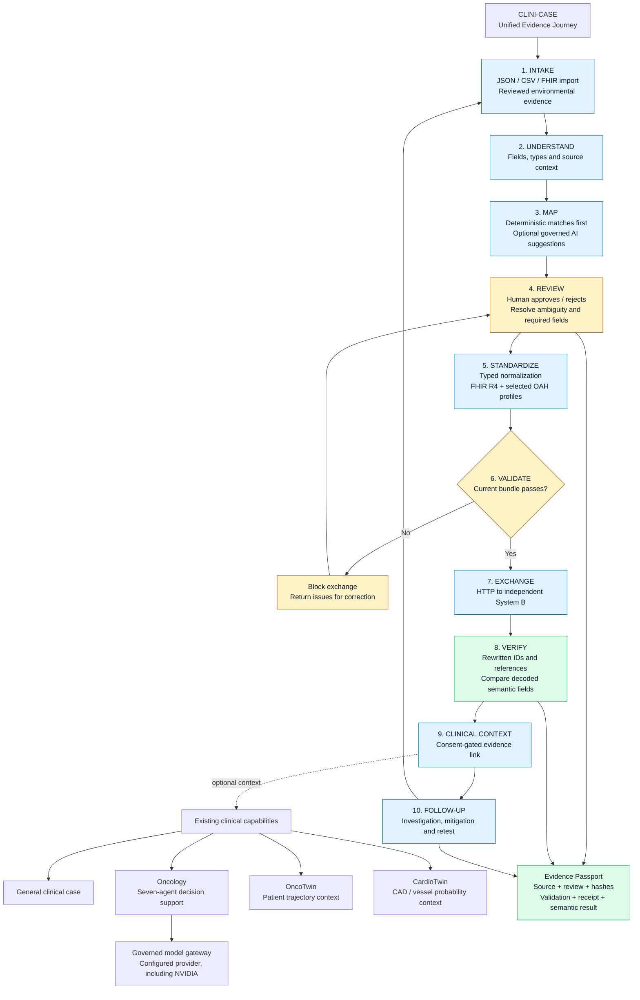
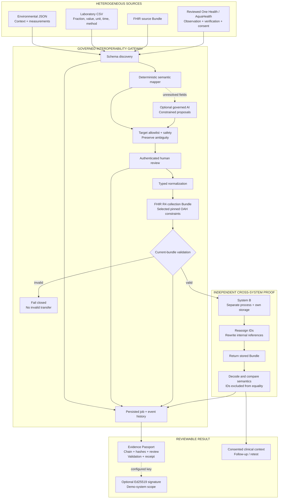
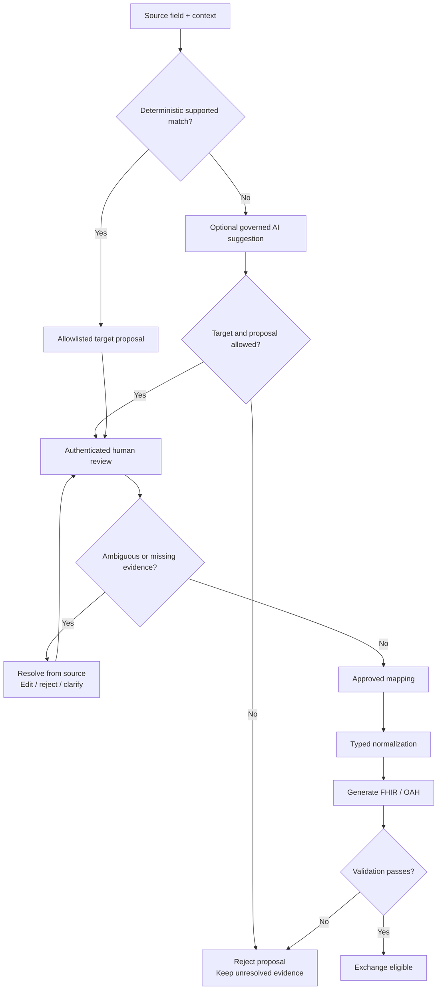
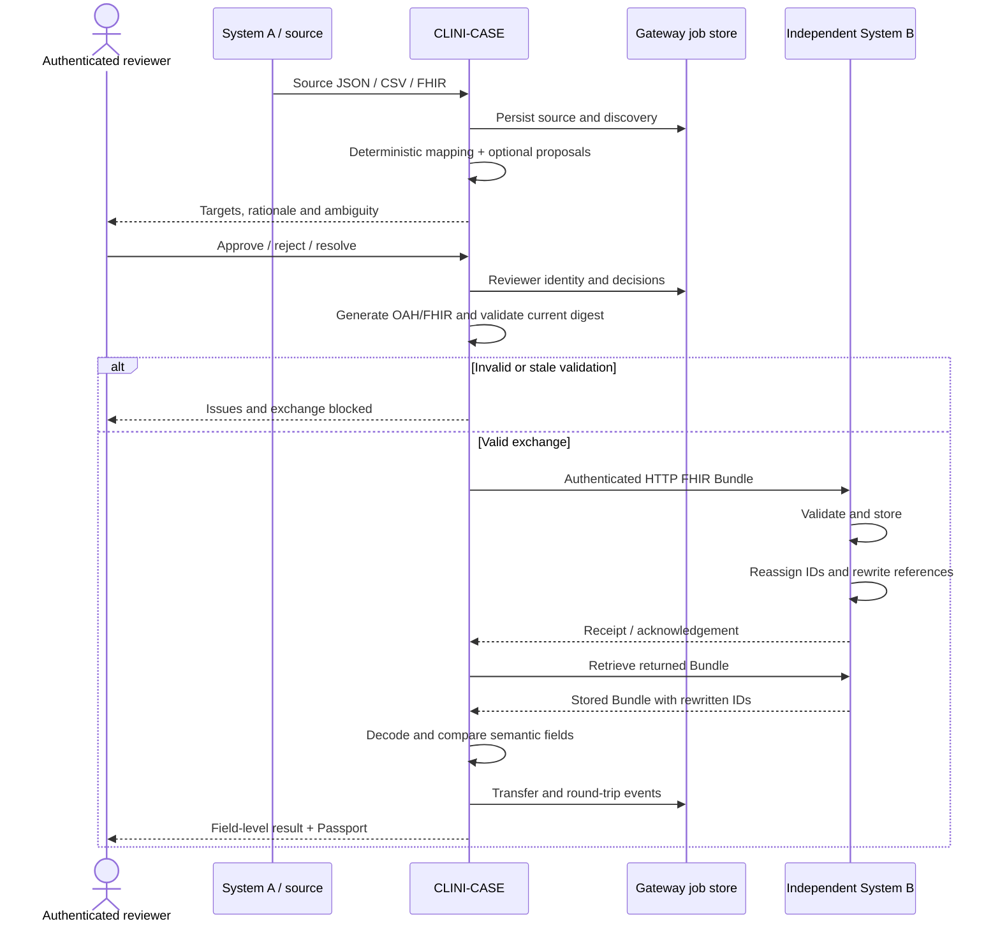
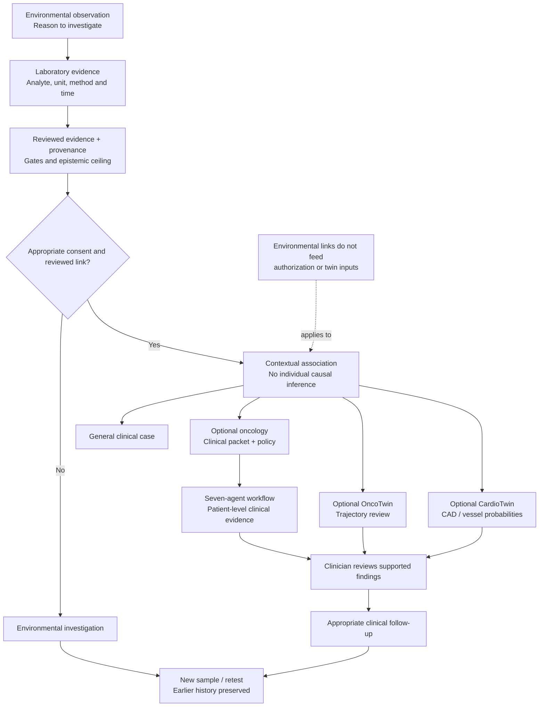
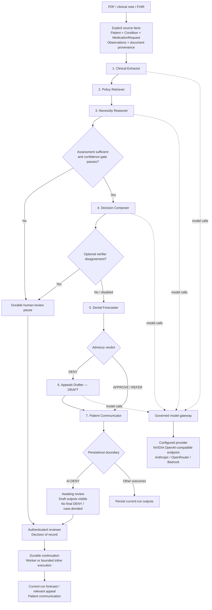
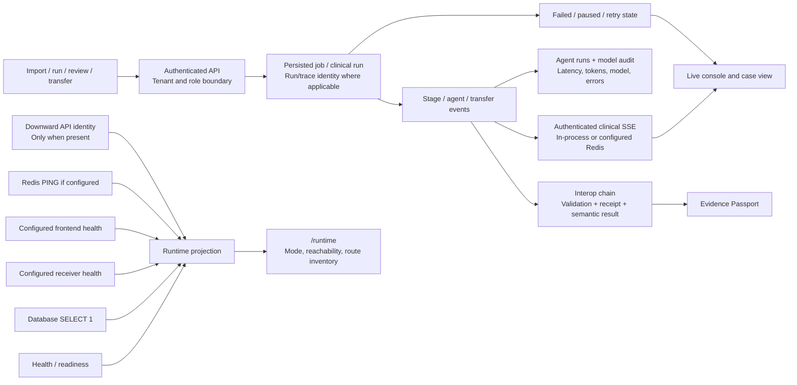
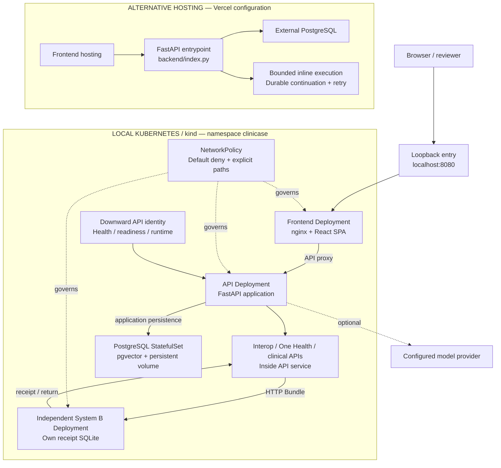

# CLINI-CASE
## One Health Evidence & Interoperability Platform

**"From Evidence to Action, Through One Connected Clinical Journey."**

CLINI-CASE connects intake, environmental and clinical evidence, interoperability, human review, AI-assisted analysis, clinical context and follow-up in one traceable workflow.

**Live demo (deployed from this repository on Render):**

| | Link |
|---|---|
| Application | https://clini-case.onrender.com |
| Sign in | https://clini-case.onrender.com/login — click **Admin**, **Reviewer** or **Coordinator**; no password needed |
| API documentation | https://clini-case.onrender.com/docs |
| Health check | https://clini-case.onrender.com/api/v1/healthz |
| Source | https://github.com/victrvondoom/CLINI-CASE |

The demo runs on a free instance, so the first request after a quiet period can take about a minute to wake it. Every push to `main` redeploys automatically from the root [`Dockerfile`](Dockerfile) and [`render.yaml`](render.yaml): one container serves the React interface and the FastAPI backend on a single address.

[](https://github.com/victrvondoom/CLINI-CASE/actions/workflows/ci.yml)

**Built for OneAquaHealth IEEE Global Hackathon — Track 7: Digital Health Standards.**

Environmental, laboratory and clinical systems describe evidence with incompatible fields, units, terminology and identifiers. CLINI-CASE makes those differences visible, requires human approval of their interpretation, generates standards-based exchanges and tests whether another system preserves their meaning.

One platform combines evidence intake, environmental observations, laboratory data, semantic mapping, human review, FHIR/OAH standardization, validation, independent exchange, round-trip verification and provenance. Optional clinical contexts connect this journey to oncology decision support, OncoTwin, CardioTwin and follow-up. Docker and local Kubernetes support reproducible deployment of the same application.

> **Central Track 7 contribution:** heterogeneous environmental, laboratory and health data can be transformed into a governed standards-based exchange without allowing AI to silently invent clinical meaning.

> **Clinical boundary:** CLINI-CASE does not infer that an environmental measurement caused a specific disease in an individual. It preserves the evidence chain and provides structured context for appropriate human review. Environmental evidence does not change cancer authorization or OncoTwin/CardioTwin model inputs.

## Start here

| Purpose | Entry point |
|---|---|
| Complete evidence journey | `/journey` · [workflow guide](docs/UNIFIED_JOURNEY.md) |
| Deterministic local demo | `./start-track7.ps1 -SQLite` · [runbook](docs/DEMO_RUNBOOK.md) |
| Independent HTTP proof | `python backend/scripts/track7_network_demo.py` |
| Actual deployment topology | `/runtime` · [Kubernetes runbook](docs/KUBERNETES.md) |
| Standards evidence | [validation](docs/track7/VALIDATION.md) · [conformance](docs/track7/CONFORMANCE.md) |
| Publication checks | [final verification](docs/FINAL_PUBLICATION_VERIFICATION.md) |

## One connected evidence journey

The journey orchestrates existing APIs. A persisted interoperability job carries its source, mapping decisions, bundle, validation and exchange events. Stage status is a read-only server projection; completed stages cite their proof events. Clinical context and follow-up use the bound One Health evidence.


```mermaid
flowchart TD
    START["CLINI-CASE<br/>Unified Evidence Journey"]
    START --> A["1. INTAKE<br/>JSON / CSV / FHIR import<br/>Reviewed environmental evidence"]
    A --> B["2. UNDERSTAND<br/>Fields, types and source context"]
    B --> C["3. MAP<br/>Deterministic matches first<br/>Optional governed AI suggestions"]
    C --> D["4. REVIEW<br/>Human approves / rejects<br/>Resolve ambiguity and required fields"]
    D --> E["5. STANDARDIZE<br/>Typed normalization<br/>FHIR R4 + selected OAH profiles"]
    E --> F{"6. VALIDATE<br/>Current bundle passes?"}
    F -->|No| FIX["Block exchange<br/>Return issues for correction"]
    FIX --> D
    F -->|Yes| G["7. EXCHANGE<br/>HTTP to independent System B"]
    G --> H["8. VERIFY<br/>Rewritten IDs and references<br/>Compare decoded semantic fields"]
    H --> I["9. CLINICAL CONTEXT<br/>Consent-gated evidence link"]
    I --> J["10. FOLLOW-UP<br/>Investigation, mitigation and retest"]
    J --> A
    I -. optional context .-> K["Existing clinical capabilities"]
    K --> K1["General clinical case"]
    K --> K2["Oncology<br/>Seven-agent decision support"]
    K --> K3["OncoTwin<br/>Patient trajectory context"]
    K --> K4["CardioTwin<br/>CAD / vessel probability context"]
    K2 --> P["Governed model gateway<br/>Configured provider, including NVIDIA"]
    D --> R["Evidence Passport<br/>Source + review + hashes<br/>Validation + receipt + semantic result"]
    H --> R
    J --> R
    classDef stage fill:#e0f2fe,stroke:#0369a1,color:#0f172a
    classDef human fill:#fef3c7,stroke:#b45309,color:#0f172a
    classDef proof fill:#dcfce7,stroke:#15803d,color:#0f172a
    class A,B,C,E,G,I,J stage
    class D,F,FIX human
    class H,R proof
```

| Stage | Advancement and safety |
|---|---|
| Intake | Preserve original payload, source identity, synthetic flag and ingest event. |
| Understand | Display fields/types before interpreting them. |
| Map | Retain source field, target, method, rationale and ambiguity. |
| Review | Record authenticated decisions; unresolved required fields block generation. |
| Standardize | Make analyte, units, times, laboratory and location explicit. |
| Validate | Bind outcome to the current generated bundle digest. |
| Exchange | Record HTTP acknowledgement, receipt and transfer identity. |
| Verify | Compare semantics independently of resource IDs. |
| Clinical context | Require appropriate consent; association is contextual evidence. |
| Follow-up | Add investigation/new retest without overwriting earlier history. |

`/onehealth` and `/interop` remain available as workbenches. Regeneration requires fresh validation. Binding new evidence changes the exchange's evidence and requires regeneration for an up-to-date Passport.

## OneAquaHealth Track 7 — Digital Health Standards

### Fragmentation and the governed boundary

A laboratory CSV may report `sample_no`, `arsenic_dissolved` and `ug/l`; another system expects FHIR resources, terminology, UCUM units and references. A syntactically valid file can still carry the wrong analyte meaning. CLINI-CASE addresses the interpretation as well as the transport:

**Source → schema discovery → constrained mapping → human review → OAH/FHIR → validation → independent HTTP exchange → semantic round trip.**


```mermaid
flowchart TB
    subgraph SOURCES["HETEROGENEOUS SOURCES"]
        S1["Environmental JSON<br/>Context + measurements"]
        S2["Laboratory CSV<br/>Fraction, value, unit, time, method"]
        S3["FHIR source Bundle"]
        S4["Reviewed One Health / AquaHealth<br/>Observation + verification + consent"]
    end
    subgraph GATEWAY["GOVERNED INTEROPERABILITY GATEWAY"]
        D["Schema discovery"]
        M["Deterministic semantic mapper"]
        AI["Optional governed AI<br/>Constrained proposals"]
        SAFE["Target allowlist + safety<br/>Preserve ambiguity"]
        H["Authenticated human review"]
        N["Typed normalization"]
        F["FHIR R4 collection Bundle<br/>Selected pinned OAH constraints"]
        V{"Current-bundle validation"}
        BLOCK["Fail closed<br/>No invalid transfer"]
        STORE["Persisted job + event history"]
    end
    subgraph EXCHANGE["INDEPENDENT CROSS-SYSTEM PROOF"]
        B["System B<br/>Separate process + own storage"]
        IDS["Reassign IDs<br/>Rewrite internal references"]
        R["Return stored Bundle"]
        RT["Decode and compare semantics<br/>IDs excluded from equality"]
    end
    subgraph PROOF["REVIEWABLE RESULT"]
        EP["Evidence Passport<br/>Chain + hashes + review<br/>Validation + receipt"]
        SIG["Optional Ed25519 signature<br/>Demo-system scope"]
        CTX["Consented clinical context<br/>Follow-up / retest"]
    end
    S1 --> D
    S2 --> D
    S3 --> D
    S4 --> D
    D --> M
    M --> SAFE
    M -. unresolved fields .-> AI
    AI --> SAFE
    SAFE --> H --> N --> F --> V
    V -->|invalid| BLOCK
    V -->|valid| B
    B --> IDS --> R --> RT
    D --> STORE
    H --> STORE
    V --> STORE
    RT --> STORE
    STORE --> EP
    EP -. configured key .-> SIG
    RT --> CTX
```

### Distinctive mechanisms

| Mechanism | Purpose |
|---|---|
| Semantic firewall | Evidence cannot silently become stronger clinical meaning. |
| Constrained mapping | Supported targets only; deterministic mapping precedes AI. |
| Human approval | Authenticated reviewers decide what the source supports. |
| Ambiguity protection | Generic arsenic never silently becomes dissolved, total or inorganic arsenic. |
| OAH/FHIR generation | Explicit resources/references rather than opaque files. |
| Independent HTTP receiver | Cross a process and storage boundary. |
| Resource-ID independence | Challenge assumptions by changing identifiers/references. |
| Semantic round trip | Compare decoded analyte, value, unit, time, lab, location and evidence. |
| Evidence Passport | Inspect source, review, validation, receipts and results. |
| Fail-closed validation | Invalid units, malformed bundles and stale validation block delivery. |

These are implemented choices and demonstration evidence, not a claim that this is the first system to use FHIR, AI mapping or provenance.

### Semantic safety: AI can suggest; AI cannot certify


```mermaid
flowchart TD
    X["Source field + context"] --> D{"Deterministic supported match?"}
    D -->|Yes| A["Allowlisted target proposal"]
    D -->|No| AI["Optional governed AI suggestion"]
    AI --> G{"Target and proposal allowed?"}
    G -->|No| BLOCK["Reject proposal<br/>Keep unresolved evidence"]
    G -->|Yes| HUMAN["Authenticated human review"]
    A --> HUMAN
    HUMAN --> AMB{"Ambiguous or missing evidence?"}
    AMB -->|Yes| MANUAL["Resolve from source<br/>Edit / reject / clarify"]
    MANUAL --> HUMAN
    AMB -->|No| APPROVE["Approved mapping"]
    APPROVE --> N["Typed normalization"]
    N --> FHIR["Generate FHIR / OAH"]
    FHIR --> VALID{"Validation passes?"}
    VALID -->|No| BLOCK
    VALID -->|Yes| SEND["Exchange eligible"]
```

A bare `arsenic` field does not establish sample fraction or chemical speciation. Explicit `arsenic_dissolved` may use the pinned dissolved concept when the source supports it. Total and inorganic arsenic are distinct. Unsupported terminology remains text/local coding. The demonstrated contract blocks unsupported `ppm`; conversion is not guessed.

Mapping AI receives field names/schema and allowlisted targets, not measured values or patient context. It cannot select arsenic speciation, invent terminology or approve its proposal. The governed AI path needs its PostgreSQL infrastructure; the deterministic SQLite demo works independently.

### Exchange: changed IDs, preserved meaning


```mermaid
sequenceDiagram
    actor Reviewer as Authenticated reviewer
    participant A as System A / source
    participant C as CLINI-CASE
    participant DB as Gateway job store
    participant B as Independent System B
    A->>C: Source JSON / CSV / FHIR
    C->>DB: Persist source and discovery
    C->>C: Deterministic mapping + optional proposals
    C-->>Reviewer: Targets, rationale and ambiguity
    Reviewer->>C: Approve / reject / resolve
    C->>DB: Reviewer identity and decisions
    C->>C: Generate OAH/FHIR and validate current digest
    alt Invalid or stale validation
        C-->>Reviewer: Issues and exchange blocked
    else Valid exchange
        C->>B: Authenticated HTTP FHIR Bundle
        B->>B: Validate and store
        B->>B: Reassign IDs and rewrite references
        B-->>C: Receipt / acknowledgement
        C->>B: Retrieve returned Bundle
        B-->>C: Stored Bundle with rewritten IDs
        C->>C: Decode and compare semantic fields
        C->>DB: Transfer and round-trip events
        C-->>Reviewer: Field-level result + Passport
    end
```

The separate-process network fixture preserves **13/13 semantic fields** despite rewritten IDs and blocks invalid-unit/malformed-bundle transfers. Richer reviewed-evidence fixtures add fields; the UI reports the actual comparison count. Reproduce using the [network demo](backend/scripts/track7_network_demo.py) and [judge script](docs/track7/DEMO_SCRIPT.md).

## From environmental evidence to human-health context

**Observation → laboratory evidence → exposure context → clinical review → optional specialist context → follow-up/retest.** A photo may justify investigation; it cannot establish arsenic concentration. A laboratory concentration does not establish an individual's exposure duration, dose, diagnosis or disease cause.

| Exposure/evidence | Established health context | Platform boundary |
|---|---|---|
| Long-term inorganic arsenic exposure through drinking water | WHO describes cancer/skin lesions and associations with cardiovascular disease and diabetes. [WHO arsenic fact sheet](https://www.who.int/news-room/fact-sheets/detail/arsenic) | The implemented arsenic workflow preserves analyte/fraction, source and review. It does not establish speciation, individual exposure or causality. |
| Microbial contamination | Contaminated water can transmit intestinal infections associated with diarrhoeal disease. [WHO diarrhoeal disease fact sheet](https://www.who.int/news-room/fact-sheets/detail/diarrhoeal-disease) | Broader One Health motivation; pathogen diagnosis/prediction is not implemented by the arsenic gateway. |

These are public-health relationships, not water-to-disease model outputs. Population indicators are not individual disease predictions.


```mermaid
flowchart TD
    OBS["Environmental observation<br/>Reason to investigate"] --> LAB["Laboratory evidence<br/>Analyte, unit, method and time"]
    LAB --> VERIFIED["Reviewed evidence + provenance<br/>Gates and epistemic ceiling"]
    VERIFIED --> CONSENT{"Appropriate consent and reviewed link?"}
    CONSENT -->|No| ENV["Environmental investigation"]
    CONSENT -->|Yes| CONTEXT["Contextual association<br/>No individual causal inference"]
    CONTEXT --> GENERAL["General clinical case"]
    CONTEXT --> ONC["Optional oncology<br/>Clinical packet + policy"]
    CONTEXT --> OT["Optional OncoTwin<br/>Trajectory review"]
    CONTEXT --> CT["Optional CardioTwin<br/>CAD / vessel probabilities"]
    ONC --> AGENTS["Seven-agent workflow<br/>Patient-level clinical evidence"]
    OT --> REVIEW["Clinician reviews supported findings"]
    CT --> REVIEW
    AGENTS --> REVIEW
    REVIEW --> FOLLOW["Appropriate clinical follow-up"]
    ENV --> RETEST["New sample / retest<br/>Earlier history preserved"]
    FOLLOW --> RETEST
    BOUNDARY["Environmental links do not feed<br/>authorization or twin inputs"] -. applies to .-> CONTEXT
```

One Health computes an epistemic ceiling through six gates: laboratory verification, active consent, drinking pathway, point-of-use sample, treatment/use context and temporal overlap. Imported consent/verification is not automatically trusted. Oncology and twins are optional; many investigations need none of them. See [One Health](docs/ONEHEALTH_TRACK7.md), [evidence gates](docs/EPISTEMIC_CEILING.md) and [Passport](docs/EVIDENCE_PASSPORT.md).

## Existing clinical and AI capabilities

### Seven-agent oncology workflow

The existing LangGraph DAG has seven parent agents and **22 sub-agents: 15 LLM-backed and seven deterministic**. It is separate from Track 7 mapping. Both use the existing governed model infrastructure where AI is enabled; oncology agents do not perform Track 7 mapping.

| # | Agent | Responsibility | Typed output |
|---|---|---|---|
| 1 | Clinical Extractor | Validate/minimize packet; structure facts | `ClinicalSnapshot` |
| 2 | Policy Retriever | Retrieve configured payer-policy excerpts | Policy excerpts |
| 3 | Necessity Reasoner | Criteria: met, not met, undocumented | `NecessityAssessment` |
| 4 | Decision Composer | Evidence-linked advisory determination | `Decision` |
| 5 | Denial Forecaster | Advisory denial reasons/risk, not disease prediction | `DenialForecast` |
| 6 | Appeals Drafter | Appeal draft on DENY branch | `AppealDraft` |
| 7 | Patient Communicator | Plain-language explanation/next steps | `PatientCommunication` |


```mermaid
flowchart TD
    PACKET["PDF / clinical note / FHIR"] --> FACTS["Explicit source facts<br/>Patient + Condition + MedicationRequest<br/>Observations + document provenance"]
    FACTS --> EXTRACT["1. Clinical Extractor"]
    EXTRACT --> POLICY["2. Policy Retriever"]
    POLICY --> REASON["3. Necessity Reasoner"]
    REASON --> CONF{"Assessment sufficient<br/>and confidence gate passes?"}
    CONF -->|No| EARLY["Durable human-review pause"]
    CONF -->|Yes| COMPOSE["4. Decision Composer"]
    COMPOSE --> VERIFY{"Optional verifier disagreement?"}
    VERIFY -->|Yes| EARLY
    VERIFY -->|No / disabled| FORECAST["5. Denial Forecaster"]
    FORECAST --> VERDICT{"Advisory verdict"}
    VERDICT -->|DENY| APPEAL["6. Appeals Drafter — DRAFT"]
    VERDICT -->|APPROVE / REFER| PATIENT["7. Patient Communicator"]
    APPEAL --> PATIENT
    PATIENT --> SAVE{"Persistence boundary"}
    SAVE -->|AI DENY| HOLD["Awaiting review<br/>Draft outputs visible<br/>No final DENY / case.decided"]
    SAVE -->|Other outcomes| RECORD["Persist current-run outputs"]
    EARLY --> HUMAN["Authenticated reviewer<br/>Decision of record"]
    HOLD --> HUMAN
    HUMAN --> RESUME["Durable continuation<br/>Worker or bounded inline execution"]
    RESUME --> LETTERS["Current-run forecast / relevant appeal<br/>Patient communication"]
    EXTRACT -. model calls .-> GW["Governed model gateway"]
    REASON -. model calls .-> GW
    COMPOSE -. model calls .-> GW
    APPEAL -. model calls .-> GW
    GW --> PROVIDER["Configured provider<br/>NVIDIA OpenAI-compatible endpoint<br/>Anthropic / OpenRouter / Bedrock"]
```

**PDF repair:** Intake and Cases now share conversion into a populated clinical FHIR packet from explicitly labeled facts. Missing/conflicting facts return actionable errors. Stage, dose, billing codes and DOB are not fabricated. Scans depend on configured OCR tools; arbitrary layouts still need review.

**Every AI DENY requires human review.** Synchronous and worker persistence enforce this independently of the low-confidence gate. Draft appeals/patient communication remain visible while pending. Authenticated identity and the human decision are recorded transactionally. Continuation uses a worker or inline serverless execution; failure preserves the decision and allows fenced retry. [Repair evidence](docs/ONCOLOGY_UPLOAD_REVIEW_REPAIR.md) · [human review](docs/HUMAN_REVIEW.md).

### NVIDIA and model governance

NVIDIA uses the existing OpenAI-compatible adapter: `LLM_PROVIDER=openrouter`, `OPENROUTER_BASE_URL=https://integrate.api.nvidia.com/v1` and configured `OPENROUTER_MODEL`. Variable names identify the adapter, not necessarily the destination. `OPENROUTER_API_KEY` remains a backend environment secret.

On **2026-10-04**, a live synthetic request through the existing provider client succeeded with `nvidia/nemotron-3-super-120b-a12b` (48 input tokens, six output tokens). This proves connectivity for that request, **not** full seven-agent live completion, clinical accuracy or mapping quality. Offline NVIDIA tests cover normalization/integrity without provider calls.

The agent boundary uses the governed gateway for context, model policy, quotas, audit and circuit-breaking. Output schemas, provider-specific options, JSON repair, concurrency and retries support compatible models. Unknown pricing must not be presented as measured cost. `LLM_SYSTEM_TRUST=true` needs optional `truststore`; TLS verification stays enabled. Bedrock/Guardrails are configured adapters, not required infrastructure or proof of live AWS deployment.

Track 7 works without an LLM. The launcher's `-AI` enables governed suggestions when its infrastructure is available; connectivity does not certify suggestions.

### Oncology, OncoTwin and CardioTwin in depth

| Capability | Implemented purpose | Evidence boundary |
|---|---|---|
| Oncology | Clinical extraction, policies, criterion evidence, advisory decisions, appeal/patient drafts | Demo policies/guidelines are not licensed current clinical feeds. AI DENY always awaits review. |
| Oncology stack | Guideline search, genomics/regimens, denial/appeal helpers, peer-to-peer briefing, off-label review, regimen bundling, site-of-care comparison, policy reconciliation | Helpers/simulated economics differ from live payer submission or clinical validation. |
| OncoTwin | Personal baselines, feature lineage, trajectory/change points, supported horizons, scenarios and reviewed ClinCase handoff | Demo patients/outcomes and evaluations are synthetic. No real-cohort performance claim. |
| CardioTwin | Clinical/ECG/lab/echo features yield CAD and LAD/LCX/RCA stenosis probabilities with uncertainty/integrity checks | Cross-sectional context, not future events, lesion localization or diagnostic imaging. |
| Case Digital Twin | Auditable runs, evidence, reviews, verification and cost reconciliation | Distinct from physiological modeling. |

OncoTwin's prototype `OT-ACUTE-7` uses supported 24-hour, 72-hour and seven-day horizons. Living state, baseline, feature store, trajectory, simulation, memory and handoff are in [ONCOTWIN.md](docs/ONCOTWIN.md). Synthetic benchmarks are not clinical performance.

CardioTwin uses a 303-row angiography cohort from [UCI dataset 411](https://archive.ics.uci.edu/dataset/411/extension+of+z+alizadeh+sani+dataset). Its heart visualization is schematic; what-if changes re-evaluate the model, not treatment effects. [CARDIOTWIN.md](docs/CARDIOTWIN.md).

The Hepatitis C reference case uses the same policy-driven pipeline with a different corpus. Broader specialties require appropriate evidence and validation.

## The complete platform remains available

| Area | Preserved capabilities |
|---|---|
| Workspace | Dashboard, Cases, case detail, Intake, live agent console |
| Evidence/standards | Journey, Environmental Evidence/AquaHealth, OneHealth, Track 7, Safety |
| Clinical | Oncology, OncoTwin, CardioTwin, clinical handoff |
| Research/evaluation | Research Lab, Cohorts, comparisons, evaluation harness, model operations |
| Governance/operations | Reviewer, Observability, Insights, ROI, Compliance, Foundry/Architecture, Runtime |
| Access/integration | Authentication, tenant/role controls, APIs, tests, FHIR intake, configured adapters |

Navigation groups primary pages while preserving contextual/legacy routes. `/platform` retains the platform reference; `/track7` is the focused overview. [Architecture](ARCHITECTURE.md) · [journey design](docs/UNIFIED_JOURNEY.md).

## Standards, validation and technical proof

Exchange targets **FHIR R4 4.0.1** and selected constraints from the pinned **draft OneAquaHealth guide**. Local contracts/round-trip checks complement external validation; they do not replace full profile/terminology validation.

The **recorded 2026-10-02 sample** was tested with official HL7 validator **6.10.4**. Its OAH package was compiled locally from source commit `b907cf0869b59d82d9138b3d147fca66f333d911`; no published package was available.

| Recorded configuration | Errors | Warnings | Information |
|---|---:|---:|---:|
| FHIR R4, terminology disabled | 0 | 21 | 7 |
| FHIR R4 + pinned OAH, terminology disabled | 0 | 16 | 3 |
| FHIR R4 + pinned OAH + terminology server | 0 | 15 | 3 |

Warnings include narrative, local terminology and provenance/location issues and were retained. The current exporter passes local checks and reproduces the recorded structure after timestamp normalization; the external validator was **not rerun for this publication**. [Exact hashes, commands and warnings](docs/track7/VALIDATION.md). This is not FHIR/OAH certification or full OAH conformance.

An independent public FHIR R4 server accepted the recorded sample ([third-party check](docs/track7/THIRD_PARTY_INTEROP.md)). This proves generic exchange for that sample, not OAH validation or permanent availability.

| Capability | Demonstration and scope |
|---|---|
| Mapping | Deterministic + governed adapter; connectivity alone does not prove live quality |
| Human governance | Authenticated mapping review/audit; DENY review regression tests |
| FHIR/OAH | Collection Bundle with selected pinned profiles/constraints |
| Validation | Current local checks and recorded external results above |
| Independent exchange | Separate-process HTTP System B with own storage |
| ID independence | Reassigned IDs and rewritten references |
| Round trip | Network fixture preserves 13/13 semantic fields |
| Passport | Persisted chain, hashes, receipts, optional Ed25519 signing |
| Fail closed | Invalid units/malformed bundles blocked; stale validation rejected |
| Deployment | Docker/kind manifests; current availability reported separately |
| AI | Existing governed seven-agent architecture; live NVIDIA connectivity probe passed |

Optional Ed25519 signing attests to demo-system Passport bytes, not lab/clinician/government/third-party certification. Unsigned deployments report unsigned status. Chain validity and signature authenticity are separate.

## Monitoring, observability and verification

Progress connects to persisted evidence and reachable services. Failed or unfinished work remains visible.


```mermaid
flowchart LR
    USER["Import / run / review / transfer"] --> API["Authenticated API<br/>Tenant and role boundary"]
    API --> JOB["Persisted job / clinical run<br/>Run/trace identity where applicable"]
    JOB --> EVENTS["Stage / agent / transfer events"]
    EVENTS --> SSE["Authenticated clinical SSE<br/>In-process or configured Redis"]
    SSE --> UI["Live console and case view"]
    EVENTS --> AUDIT["Agent runs + model audit<br/>Latency, tokens, model, errors"]
    EVENTS --> PASS["Interop chain<br/>Validation + receipt + semantic result"]
    PASS --> PASSPORT["Evidence Passport"]
    JOB --> FAIL["Failed / paused / retry state"]
    FAIL --> UI
    PROBE["Health / readiness"] --> RUNTIME["Runtime projection"]
    DB["Database SELECT 1"] --> RUNTIME
    RECEIVER["Configured receiver health"] --> RUNTIME
    FRONT["Configured frontend health"] --> RUNTIME
    REDIS["Redis PING if configured"] --> RUNTIME
    K8S["Downward API identity<br/>Only when present"] --> RUNTIME
    RUNTIME --> OPS["/runtime<br/>Mode, reachability, route inventory"]
```

- **Health:** API `/api/v1/healthz` and `/api/v1/readyz`; receiver/container frontend `/healthz`. Readiness checks DB availability.
- **Clinical trace:** authenticated org-scoped SSE, persisted `agent_runs` and saved progress recovery.
- **Artifacts:** run/trace identity, review attribution and current-run selection prevent stale drafts appearing as latest results.
- **Exchange history:** discovery, mapping, review, generation, validation, receipts and semantics provide stage proof.
- **Runtime:** `GET /api/v1/runtime` probes server-configured services; cluster identity appears only when actually supplied.
- **kind verification:** checks workloads, services, readiness, login, runtime, exchange and isolation when available.

Runtime does not fabricate CPU metrics, replicas, SLAs or accuracy. A separate legacy oncology chain is in-memory, distinct from persisted Track 7 events. [Run identity](docs/RUN_IDENTITY.md) · [hardening](docs/PLATFORM_HARDENING.md) · [testing](docs/TESTING.md).

## Data, attribution and transformation

| Class | Source/publisher | License/retrieval | Transformation and limits |
|---|---|---|---|
| Synthetic Track 7 | Handwritten CLINI-CASE JSON/CSV/evidence | Repository terms; `backend/data/interop/` | Mapping/normalization/FHIR; no real site/lab/patient claim. |
| Synthetic clinical/twins | CLINI-CASE packets, trajectories, outcomes | Repository terms; local scripts | Demo/offline evaluation, not licensed live clinical feeds. |
| Real water adapter | WQP; NWQMC, USGS, EPA | Retrieval recorded 2026-10-02; raw rows **not committed**, redistribution permission unconfirmed | Curated stream sample; source/query/time/transform history retained locally; proxies require review. |
| Real CardioTwin cohort | UCI dataset 411 | **CC BY 4.0**; attribution/import/SHA pins in [dataset README](backend/data/cardiotwin/README.md) | 303-row cross-sectional data; derived artifact, not live EHR/prospective validation. |
| Derived exchanges/scores | Corresponding evidence/model inputs | Inherit source restrictions/provenance | Normalization/probabilities do not create independent clinical evidence. |

The WQP fetcher records query URLs, retrieval time, verbatim source/station rows and transformations. It retains explicit dissolved/total fraction and skips unsupported qualifiers/units. This is not a monitoring dataset and supports no health inference. Keep fetched output outside Git until terms are confirmed. [Source/license decision](docs/track7/DATA_SOURCES.md).

```powershell
cd backend
python scripts/fetch_external_water_data.py --out <path-outside-repo>/wqp_arsenic.json
```

## Deployment: one application, several modes

Docker provides containerization, Kubernetes orchestration and kind a local/free cluster. Deterministic exchange needs no cloud account or paid infrastructure; optional models/services may cost money. AWS/EKS material in `ops/` describes portability/configuration, not a claim of live deployment.


```mermaid
flowchart TD
    USER["Browser / reviewer"] --> LOOP["Loopback entry<br/>localhost:8080"]
    subgraph KIND["LOCAL KUBERNETES / kind — namespace clinicase"]
        WEB["Frontend Deployment<br/>nginx + React SPA"]
        API["API Deployment<br/>FastAPI application"]
        INTEROP["Interop / One Health / clinical APIs<br/>Inside API service"]
        DB["PostgreSQL StatefulSet<br/>pgvector + persistent volume"]
        RECEIVER["Independent System B Deployment<br/>Own receipt SQLite"]
        POLICY["NetworkPolicy<br/>Default deny + explicit paths"]
        ID["Downward API identity<br/>Health / readiness / runtime"]
    end
    LOOP --> WEB
    WEB -->|API proxy| API
    API --> INTEROP
    API -->|application persistence| DB
    INTEROP -->|HTTP Bundle| RECEIVER
    RECEIVER -->|receipt / return| INTEROP
    POLICY -. governs .-> WEB
    POLICY -. governs .-> API
    POLICY -. governs .-> RECEIVER
    ID --> API
    API -. optional .-> MODEL["Configured model provider"]
    subgraph SERVERLESS["ALTERNATIVE HOSTING — Vercel configuration"]
        SPA["Frontend hosting"]
        FN["FastAPI entrypoint<br/>backend/index.py"]
        EXTERNALDB["External PostgreSQL"]
        INLINE["Bounded inline execution<br/>Durable continuation + retry"]
    end
    SPA --> FN
    FN --> EXTERNALDB
    FN --> INLINE
```

System B owns storage and does not share application PostgreSQL. Local kind manifests supply no always-on clinical worker; queues need a worker or inline execution. Hosted Track 7 also needs a separately reachable configured receiver.

### Local reference journey

Prerequisites: Python 3.11+, Node.js 20+, npm. From repository root:

```powershell
python -m pip install -e "backend[dev]"
cd frontend
npm ci
cd ..
./start-track7.ps1 -SQLite
```

Open the launcher URL and start `/journey`. Runtime files are ignored; API/receiver are separate processes. The intentionally simple local-demo credential is in the [runbook](docs/DEMO_RUNBOOK.md); production auth retains its own configuration. Use `-AI` when choosing governed provider calls.

### Local Kubernetes

With Docker Desktop running, kind and kubectl installed:

```powershell
python k8s/cluster.py up
python k8s/cluster.py verify
python k8s/cluster.py credentials
```

The helper targets its owned `kind-clinicase` context and writes credentials to an ignored file. `verify` proves current reachability/isolation; manifests alone do not. Docker's Linux engine was stopped at publication, so current cluster verification is **not passed**. [Runbook](docs/KUBERNETES.md).

### Developer and hosted configuration

- Copy `.env.example` to private `.env`; configure needed services. Never commit keys, DB/JWT credentials or Passport private keys.
- Standard dev: PostgreSQL, `uvicorn app.main:app --reload --port 8000` from `backend/`, `npm run dev` from `frontend/`. Compose initializes the local DB; `--profile full` also starts API/frontend. [Setup/testing](docs/TESTING.md).
- `docker-compose.track7.yml` includes System B and needs explicit local secrets. SQLite is the simpler deterministic demo.
- Vercel entrypoint initializes app lifespan before requests. Review continuation is inline automatically on Vercel or with `HUMAN_REVIEW_CONTINUATION_MODE=inline`. Default timeout: 240 seconds; hosting limits must accommodate it. Timeout preserves the human decision and retry state.
- Readiness cron is not a clinical worker. Production long-running work needs suitable capacity and operational validation.

## Verification commands

```powershell
# backend/
python -m pytest
python -m pytest tests/onehealth tests/interop -q
python -m ruff check app tests
# frontend/
npm test -- --run
npm run typecheck
npm run build
# repository root
python backend/scripts/track7_network_demo.py
python k8s/cluster.py verify
git diff --check
```

Default pytest excludes marked `integration`/`live` tests. PostgreSQL contracts and metered models need separate checks; green offline tests are not clinical validation. [Final verification](docs/FINAL_PUBLICATION_VERIFICATION.md) records totals/browser proof/infrastructure limits.

## Repository map

```text
CLINI-CASE/
├── frontend/
│   ├── src/routes/        Journey, Runtime, Interop, OneHealth, clinical/twin pages
│   ├── src/components/    Shell, agent console, review and evidence views
│   ├── src/lib/           API, SSE and clinical intake conversion
│   └── tests/             UI/workflow regressions
├── backend/
│   ├── app/interop/       Mapping, safety, exchange and System B
│   ├── app/onehealth/     Evidence gates, FHIR and Passport
│   ├── app/journey/       Persisted stage projection
│   ├── app/api/           Authenticated APIs and Runtime
│   ├── app/agents/        Clinical agents, intake and sub-agents
│   ├── app/graph/         Clinical/review LangGraph DAGs
│   ├── app/llm/           Governed gateway/provider adapters
│   ├── app/oncotwin/      Trajectory, simulation, research, safety
│   ├── app/cardiotwin/    Import, training, integrity, serving
│   ├── app/workers/       Durable clinical worker
│   ├── data/interop/      Synthetic deterministic fixtures
│   ├── scripts/           HTTP demo, export, external-data fetch
│   ├── tests/             Contracts, safety, regressions
│   ├── index.py           Vercel entrypoint
│   └── vercel.json        Backend hosting configuration
├── k8s/                  Local kind helper/manifests
├── ops/                  Cloud/container/worker references
├── docs/                 Architecture, evidence, validation, runbooks
├── demo_pdfs/            Synthetic clinical packets
├── docker-compose.yml
├── docker-compose.track7.yml
├── start-track7.ps1
└── Makefile
```

## Limits and next validation work

The prototype demonstrates governed exchange, review and traceability. It does not establish individual environmental causality, prospective clinical accuracy, certification or production reliability.

Remaining work: broader external profile/terminology coverage, licensed/current clinical feeds, real-cohort evaluation, full Da Vinci PAS/CRD/DTR and X12 278 integration, production workers and a reachable hosted receiver. PAS-shaped intake queues a case; CRD/DTR and payer adapters retain configured/stub status rather than implying live payer submission. Best-effort identifier minimization is not HIPAA de-identification certification.

## Documentation and project terms

- [Track 7 APIs](docs/ONEHEALTH_TRACK7.md) · [judge demo](docs/track7/DEMO_SCRIPT.md)
- [Passport](docs/EVIDENCE_PASSPORT.md) · [epistemic ceiling](docs/EPISTEMIC_CEILING.md) · [conformance](docs/OAH_CONFORMANCE.md)
- [Build scope/reuse](docs/HACKATHON_BUILD_SCOPE.md) · [self-audit](docs/TRACK7_SELF_AUDIT.md) · [judge access](docs/JUDGE_ACCESS.md)
- [AquaHealth](docs/AQUAHEALTH_TRACK3.md) · [OncoTwin](docs/ONCOTWIN.md) · [CardioTwin](docs/CARDIOTWIN.md)
- [Human review](docs/HUMAN_REVIEW.md) · [security processing](docs/SECURITY_PROCESSING.md) · [case twin](docs/CASE_DIGITAL_TWIN.md)
- [Contributing](CONTRIBUTING.md) · [security reporting](SECURITY.md)

Designed and built by **[vsrupeshkumar](https://github.com/vsrupeshkumar)**. Git history and scope records represent prior development/current hardening; this synchronization does not claim to have created the entire platform.

**License:** Copyright © 2026 vsrupeshkumar. All rights reserved. The [proprietary LICENSE](LICENSE) remains in force. Public visibility grants no usage/redistribution rights; written run/review authorization and third-party terms remain as documented in [judge access](docs/JUDGE_ACCESS.md).
