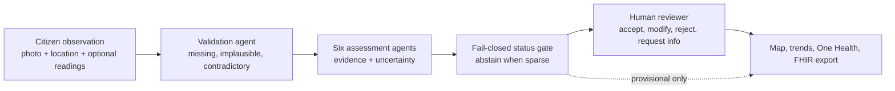

# AquaHealth Sentinel — OneAquaHealth Track 3

> **Supporting track:** Track 3 — AI-Supported Assessment. The primary submission is now
> [Track 7 — ClinCase One Health](ONEHEALTH_TRACK7.md). This document describes the retained
> environmental assessment and safety-benchmark features.
> **Tagline:** No missing answer becomes false reassurance.

AquaHealth Sentinel turns citizen observations of urban freshwater ecosystems
into transparent, provisional assessments. It validates incomplete,
contradictory and implausible inputs; shows the evidence behind every finding;
abstains when information is insufficient; and routes the result to a human
reviewer who can accept, modify, reject or request more information.

It is an additive module inside ClinCase. No ClinCase, OncoTwin or CardioTwin
feature or route was removed to create it.

## The problem

Citizen observations expand the reach of freshwater monitoring, but reports
are often incomplete or internally inconsistent. A simple scoring system can
silently turn "I did not check" into "nothing was wrong," producing false
reassurance. A black-box prediction creates a second problem: reviewers cannot
tell which submitted facts drove it.

## The Track 3 answer

1. **Guided four-state capture:** every qualitative answer is `observed`,
   `not_observed`, `unknown` or `not_available`. Unknown information never
   becomes negative evidence.
2. **Seven bounded assessment agents:** validation, water quality,
   biodiversity, environmental context, trends, One Health relevance and
   explanation. The current agents are deterministic and use no LLM.
3. **Explainability by construction:** every finding includes field-level
   evidence, confidence, data quality, uncertainty and a recommended next step.
4. **Fail-closed abstention:** fewer than four informative fields produces
   `INSUFFICIENT_DATA`, never a healthy-looking result.
5. **Human authority:** the reviewer can accept, modify, reject or request more
   information. A reviewer correction becomes the effective status everywhere,
   while the original automated result remains available for audit.
6. **Honest downstream views:** map, trends, early warnings, One Health views,
   community participation and FHIR exports retain source and verification
   state. Prototype signals are never described as diagnoses or emergency
   alerts.

## Architecture



The backend is FastAPI/Pydantic. The frontend is React/TypeScript. Existing
ClinCase authentication, role checks, organisation scoping, tracing and
Postgres write-through are reused rather than duplicated.

## Reproducible safety evaluation

Open **AquaHealth → Safety evaluation** or call:

```text
GET /api/v1/aquahealth/evaluation
```

The endpoint executes 14 versioned synthetic boundary cases against the same
production functions used for submitted observations. At the current commit it
reports:

| Behaviour under test | Result |
|---|---:|
| Declared status expectations | 14/14 |
| Concerning-pattern detection | 8/8 |
| Insufficient-data abstention | 3/3 |
| Validation expectations | 14/14 |
| Sparse cases incorrectly labelled healthy | 0 |

These figures are regression evidence, not ecological validation. The expected
labels are developer-authored, the cases are synthetic, and they have not been
independently adjudicated by freshwater-ecology experts. Prospective field
evaluation is required before operational use.

## Four-minute judge walkthrough

1. Open `/aquahealth` and load the clearly labelled demonstration dataset.
2. Submit an observation with only one adverse answer. Show that the system
   returns `INSUFFICIENT_DATA` rather than interpreting missing answers as safe.
3. Open a complete concerning observation. Show field-level evidence,
   uncertainty, data-quality caps and the recommended next step.
4. Open `/aquahealth/review`. Modify a status or request more information, then
   show that the human decision propagates to the map and aggregate views while
   preserving the original assessment.
5. Open `/aquahealth/evaluation` and show that the displayed metrics are
   produced live from the assessment code.
6. Export one reviewed observation as FHIR R4 and state the limitation: the
   current environmental coding is a prototype representation, not an official
   validated OneAquaHealth profile.

## Run and verify

```bash
# Backend
cd backend
python -m pytest tests/aquahealth -q
python -m ruff check app/aquahealth app/api/aquahealth.py tests/aquahealth
python -m app.aquahealth.evaluation

# Frontend
cd ../frontend
npm install
npm run typecheck
npm test -- --run
npm run build
```

After signing in, use these routes:

| Route | Purpose |
|---|---|
| `/aquahealth` | Overview and clearly labelled demo controls |
| `/aquahealth/observations/new` | Guided citizen observation |
| `/aquahealth/observations/:id` | Evidence and explanation |
| `/aquahealth/review` | Reviewer/admin human-in-the-loop queue |
| `/aquahealth/evaluation` | Reproducible Track 3 safety benchmark |
| `/aquahealth/map` | Location and review-state view |
| `/aquahealth/trends` | Minimum-history trend analysis |
| `/aquahealth/one-health` | Cautious ecosystem-to-community pathways |

## Safety and limitations

- Prototype decision support only; not a validated environmental index.
- Not diagnostic and not a public-health determination.
- Not a real-time emergency alerting service.
- Synthetic demo data are visibly labelled and separable from real records.
- Current assessment thresholds are transparent prototype heuristics requiring
  domain-expert review and field validation.
- Current FHIR export is structurally valid R4 with AquaHealth-defined codes;
  it does not claim conformance to an official environmental profile.
- The in-process store supports demonstrations and mirrors writes to Postgres;
  a multi-instance production deployment requires a database-authoritative
  repository and operational validation.
