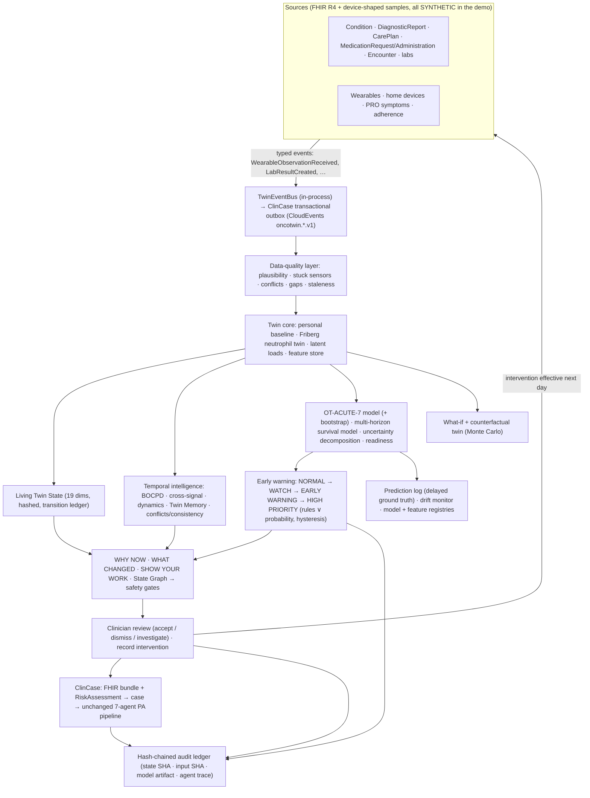

# OncoTwin — a living, explainable, predictive digital twin on top of ClinCase

> **We don't just store a cancer patient's history. We keep a living model of the patient — against their own
> baseline, across every data source — detect when and how their trajectory changes, estimate risk only at the
> horizons the data can support, simulate what could happen next, and hand clinician-accepted findings straight
> into ClinCase's prior-authorisation workflow. Every number is traceable, every state is ledgered, and the twin
> can reproduce exactly what it knew at any moment.**

OncoTwin is an **additive** layer. ClinCase's 7-agent LangGraph and its manifest, every existing endpoint, FHIR
handling, oncology reasoning, policy retrieval, prior-auth, appeals, patient communication, HITL, the citation chain
and the audit tables are unchanged. A test pins the ClinCase architecture
(`tests/oncotwin/test_twin.py::test_clincase_seven_agent_architecture_is_unchanged`), and OncoTwin reuses ClinCase
rather than duplicating it: case creation, policy retrieval (`keyword_filter`), the NCCN corpus, the transactional
outbox, auth and roles.

> [!IMPORTANT]
> **Everything in the demo is synthetic.** Patients, wearables, labs and outcomes come from OncoTwin's simulator and
> are tagged `SYNTHETIC` (FHIR `meta.tag`, API payloads, UI). All metrics are measured on held-out **synthetic**
> patients in an identical-twin experiment (§6): they show the method works end to end, not clinical performance.
> OncoTwin is clinical decision support. It never diagnoses, orders or submits anything; a clinician reviews every
> alert. What-if output is always labelled *"Simulation — not a clinical prediction or treatment recommendation."*

---

## Contents

1. [The outcome](#1-the-outcome) · 2. [Seven flagship capabilities](#2-seven-flagship-capabilities) ·
3. [Architecture](#3-architecture) · 4. [The flagship journey (OT-005)](#4-the-flagship-journey-ot-005) ·
5. [Measured results](#5-measured-results) · 6. [Honest limitations](#6-honest-limitations) ·
7. [UI](#7-ui) · 8. [API](#8-api) · 9. [Run it](#9-run-it) · 10. [Operations, safety and security](#10-operations-safety-and-security) ·
11. [What production would need](#11-what-production-would-need) · 12. [Troubleshooting](#12-troubleshooting-local-development)

---

## 1. The outcome

| | |
|---|---|
| **ID** | `OT-ACUTE-7` |
| **Outcome** | Unplanned ED visit or inpatient admission whose reason is one of the 10 CMS **OP-35** chemotherapy-related conditions (anemia, dehydration, diarrhea, emesis, fever, nausea, neutropenia, pain, pneumonia, sepsis) |
| **Horizons** | primary: onset within **7 days**; the multi-horizon model adds **24 h** and **72 h**. **6 h is declined**: signals are daily aggregates |
| **Unit** | patient-day, using only data available up to the end of that day (no look-ahead; verified by per-day recomputation) |
| **Labels** | derived **only** from qualifying FHIR `Encounter` onsets in the record, never from simulator internals |

Every risk number in the UI is a probability of this outcome with an 80 % interval.

## 2. Seven flagship capabilities

Rather than 60 shallow features, OncoTwin 2.0 makes seven capabilities deep. Everything else (MLOps, events,
observability, safety gates, the Research Lab) exists to make these seven trustworthy.

### 2.1 Living Twin State — `intel/state.py`

* **19 dimensions** in four groups: static clinical (demographic, cancer, pathology, genomic); clinical & treatment
  (clinical, treatment, medication, laboratory, adherence, intervention); dynamic against the personal baseline
  (physiological, symptom, activity, sleep, nutrition/recovery); and twin assessment (risk, trajectory, uncertainty,
  data quality).
* Each dimension carries **status, severity, basis** (fact / computed / model-derived), **confidence, data quality and
  source resource IDs**.
* **States are never overwritten.** Every day's state is hashed (SHA-256). A **transition ledger** records timestamp,
  source, previous → new, the reason for the change, confidence and data quality.
* **Debounce hysteresis:** worsening is recorded immediately, while a milder category must hold for 2 days before it
  is confirmed. The day's raw value is shown as "held" meanwhile. Without this, a trajectory flapped 25 times in a
  week.
* **WHAT CHANGED?** is a diff between two ledgered states, not a narrative.

### 2.2 Personalised baseline — `engine/baseline.py`

A robust median ± 2 × 1.4826·MAD per signal over the pre-treatment window, with per-signal floors and a measured
adequacy. Every deviation, change point, correlation and memory metric is expressed **in this patient's own SD**.
§5 shows what personalisation does and does not add.

### 2.3 Multimodal temporal fusion — `engine/`, `features/store.py`

EHR, pathology, genomics, labs, treatment, wearables (resting HR, HRV, temperature, SpO₂, steps, sleep), home devices
(weight, BP, CGM), PRO symptom burden and adherence are fused into:

* a **Friberg neutrophil twin** fitted to the patient's own ANC labs, with a grid posterior over drug sensitivity;
* **latent loads** (infection, dehydration/GI toxicity, fatigue) by weighted NNLS inversion of the observation model;
* a **feature store** with 42 features (30 model inputs + 12 analytic), each timestamped, versioned, reproducible
  (content SHA-256) and carrying lineage back to Observation and event IDs. A consistency check proves the materialised
  model features equal the deployed model's input row.

### 2.4 Trajectory and change-point intelligence — `intel/changepoint.py`, `correlation.py`, `trajectory.py`

* **Bayesian online change-point detection** (Adams & MacKay 2007) on the multivariate deviation stream. Hazard is
  1/40 days. A change point is confirmed when posterior mass ≥ 0.6 within 7 days, and called *significant* at
  posterior ≥ 0.8 with a ≥ 1.5 SD shift. Change points that coincide with a chemotherapy dose are labelled as expected
  treatment effects.
* **Cross-signal intelligence:** direction, magnitude, SD against baseline, onset, persistence and model contribution
  per signal; temporal order ("resting HR deviation preceded weight by 1 day"); lead/lag and coupling against the
  patient's own baseline coupling. These are **associations, never causes**, and every payload says so.
* **Trajectory dynamics** on the log-odds risk: slope, acceleration, and labels such as *persistent deterioration*,
  *failed recovery* or *stabilisation*.
* **Multi-horizon risk** from a discrete-time survival model, so risk is monotone across horizons by construction. A
  horizon is shown only if it meets the support policy (held-out AUROC ≥ 0.7 with ≥ 20 positives, and cadence
  allows it).

### 2.5 What-if and counterfactual twin — `engine/simulate.py`, `intel/counterfactual.py`

* **Scenario builder:** adherence, antibiotic start and course, IV hydration days, G-CSF now or with the next cycle,
  next-dose scale, dose delay, activity programme, oral hydration coaching, or a stress-test new infection. Each
  scenario runs 64 Monte Carlo forward simulations of the personalised twin, with common random numbers across
  scenarios. The five predefined scenarios are reproduced bit-identically after the refactor.
* **Counterfactual twin:** the observed twin against a twin in which nothing changed after an anchor day, with band
  coverage and first divergence.
* **Synthetic ground truth:** because the patient is simulated, the generator is re-run *without* the recorded
  interventions. That measures whether the twin's counterfactual projection was right (§6 reports where it was not).
* **The clinical loop is closed.** A clinician records an intervention; it takes effect from the next twin day. A
  hash verifies the past is unchanged. The twin then observes the response in incoming data.

### 2.6 Twin Memory — `intel/memory.py`

Per-cycle **multi-signal deterioration index** (the sum of adverse deviation beyond 1 SD across signals), with peak,
day of peak, half-recovery time and **recovery velocity** (SD/day). It also records the ANC nadir per cycle, G-CSF
use, remembered deterioration episodes with their interventions and resolution, and cycle-to-cycle similarity
(Pearson r / RMS over day-aligned deviation profiles). *Statistical similarity is not clinical equivalence.*

### 2.7 Explainable ClinCase integration — `intel/explain.py`, `intel/narrative.py`, `safety/gates.py`, `handoff.py`

* **WHY NOW?** gives the trigger; each signal against baseline (change, SD, 3-day mean, persistence, exact model
  contribution in log-odds); temporal persistence; treatment phase; model version and artifact hash; confidence;
  data quality; and Twin Readiness.
* **SHOW YOUR WORK** gives the model version and artifact SHA-256, every input reading with its Observation ID, input
  SHA-256, assumptions and the uncertainty decomposition.
* **Patient State Graph** separates recorded **facts** (solid edges), timestamp **temporal** orderings, **data**
  provenance and **model-derived associations** (dashed). Clicking a node shows its evidence.
* **Explanation agent:** the text is deterministic by default. An optional LLM synthesis is shown only if it passes
  **six safety gates**: schema; evidence (every number and ID must be traceable to the evidence bundle); freshness;
  uncertainty disclosed; safety language (no diagnosis, orders, causal claims or certainty); and model integrity.
  LLM traces store hashes and metadata only.
* **ClinCase handoff:** only after a clinician accepts (reviewer/admin, enforced). Twin evidence becomes a FHIR bundle
  with a **RiskAssessment**, then a ClinCase case through the same `create_case` path as `POST /api/v1/cases`, with
  policy sections retrieved by ClinCase's own retrieval. Nothing is submitted to a payer.
* **"What did the Digital Twin know at that moment?"** Pick any ledgered evaluation and the twin recomputes it from
  the record as of that day. It checks input SHA-256, risk, tier, model artifact and twin-state hash, and reports
  *reproduced exactly* or explains why not.

## 3. Architecture



### Agents — twin LangGraph v2 (`agents/`)

Nine deterministic agents on ClinCase's own `Agent[I, O]` framework (schema validation, budget, tracing). They live
outside `app/agents/`, so ClinCase's auto-discovered manifest is untouched.

```
data_quality → twin_state → trajectory_intelligence → temporal_intelligence → deterioration_prediction
  → [simulation, if tier ≥ WATCH or requested] → clinical_evidence → [clinical_context, if tier ≥ WATCH]
  → explanation → END
```

| Agent | Job |
|---|---|
| Data Quality | quality flags, completeness, freshness; gates what downstream agents may trust |
| Twin State | as-of view, baseline, neutrophil twin, latent loads → Living Twin State + transitions |
| Trajectory Intelligence | all signals as one multivariate trajectory; names the pattern |
| Temporal Intelligence | change points, cross-signal associations, dynamics, memory, conflicts, consistency |
| Deterioration Prediction | OT-ACUTE-7 risk, interval, contributions, rules, hysteresis → tier; multi-horizon |
| Simulation | what-if scenarios on the personalised twin |
| Clinical Evidence | what changed / why / against which baseline / over what period / what to review, with references |
| Clinical Context | treatment phase, the ClinCase request that acceptance would create, retrieved policy sections |
| Explanation | deterministic narrative, optional LLM synthesis, six safety gates |

### Deliberately **not** used

Architecture is justified by need, not by buzzwords. `GET /api/v1/oncotwin/architecture` lists each component as
*implemented*, *designed* or *not used — deliberately*, with why, data and failure behaviour. Examples: Transformer /
TFT, GRU/LSTM, gradient boosting and Isolation Forest are **not** in the model registry (the reasons are in the
registry). Kinesis/EventBridge are designed but not deployed, because the in-process bus plus ClinCase's outbox is
sufficient here.

## 4. The flagship journey (OT-005)

`make twin.demo` (or `python -m app.oncotwin.demo`) runs this end to end in about 10 s and checks 8 properties. The
same journey is the guided demo at `/twin/demo`. All numbers below are from the committed run.

| Step | What happens |
|---|---|
| Patient | OT-005, 63 M, lung adenocarcinoma stage IIIA, carboplatin + paclitaxel. Synthetic. The narrative does **not** script any clinician action |
| Baseline | Days 1–13 pre-treatment (adequacy 99 %); first dose Day 14; twin clock starts Day 20 at NORMAL |
| Detection | Each day's feed is published as events; the twin updates incrementally. **Day 23: EARLY WARNING**, 7-day risk **11.5 %** (80 % interval 7.6–14.8 %); 24 h 1.4 %, 72 h 5.0 %, 7 d 13.2 %; 6 h declined |
| WHY NOW? | risk crossed the EARLY WARNING threshold (8.2 %) with symptom burden and HRV beyond 1.5 SD of the personal baseline; the deterministic explanation passed 6/6 safety gates |
| Decision | reviewer accepts; records urgent evaluation + empiric antibiotics and G-CSF, effective Day 24; past verified unchanged |
| ClinCase | case created for pegfilgrastim (J2506) with 4 retrieved policy sections; nothing submitted |
| Response | D24 EARLY WARNING → D25 WATCH → D26 WATCH → **D27 NORMAL** → D28–29 NORMAL |
| Ground truth | the generator re-run **without** the interventions: **febrile-neutropenia admission on Day 28**; peak infection load 1.856 without vs 0.142 with |
| Audit | ledger chain valid; the Day-23 evaluation reproduced exactly (inputs, risk, tier, artifact, state hash) |

## 5. Measured results

Synthetic cohort `synthetic-cohort-20260923-1000` (version `a1093585e2cbae22`): 1 000 patients split **by patient**
60/20/20; test set of 200 patients, 7 186 patient-days, 40 events. AUROC intervals are 95 % patient-bootstrap CIs;
Δ is **paired** against the multimodal twin on the same test patients. Source: `research/results/benchmark_v1.json`
(`make twin.benchmark`, 291 s), shown in the Research Lab at `/twin/lab`.

**Modality benchmark**

| Arm | AUROC [95 % CI] | Δ vs multimodal [95 % CI] | Events caught | Median lead | False alerts / 100 pd |
|---|---|---|---|---|---|
| Static context only | 0.708 [0.623, 0.764] | −0.159 [−0.248, −0.067] | 4/40 | 4 d | 0.29 |
| Clinical-only (EHR) | 0.709 [0.613, 0.774] | −0.158 [−0.246, −0.065] | 0/40 | — | 0.01 |
| Wearable-only | 0.801 [0.748, 0.847] | −0.066 [−0.106, −0.033] | 36/40 | 4 d | 4.37 |
| Remote monitoring (wearables + home + PRO) | 0.810 [0.759, 0.857] | −0.057 [−0.096, −0.023] | 38/40 | 4 d | 3.31 |
| **Multimodal Digital Twin** | **0.866 [0.832, 0.902]** | reference | 39/40 | 4 d | 3.59 |

Arm-level event metrics use each arm's validation-derived threshold (PPV ≥ 25 %) without rules or hysteresis, so arms
are comparable. The **deployed system** (model + rules + hysteresis) alerted in advance of **39/40** events with a
median lead of **4 days**.

**Ablation** (remove one modality): wearables −0.045 [−0.080, −0.013], symptoms −0.009 [−0.017, −0.002] and home
devices −0.004 [−0.006, −0.001] are significant losses. Labs + neutrophil twin, treatment context, adherence and
multi-signal composites are not significant on AUROC.

**Personalisation:** personal against pooled-population baseline gives Δ −0.013 [−0.030, +0.003], **not
significant** (§6).

**Comparators:** population vital-sign thresholds (temp ≥ 38 °C, HR ≥ 100, SpO₂ < 92 %, SBP < 90) caught 12/40
events with a 1-day median lead. A Mahalanobis anomaly score alone gave AUROC 0.745 [0.687, 0.802].

**Multi-horizon survival model (held-out):** 24 h AUROC 0.990 [0.983, 0.997] (37 positives), 72 h 0.971
[0.955, 0.983] (109), 7 d 0.865 [0.825, 0.897] (252).

**Change points** (273 generator onsets): BOCPD sensitivity 36.6 % (median delay 2 d, 1.25 false detections / 100
patient-days) against CUSUM 20.5 % (1.75 / 100 patient-days). 317 change points coinciding with chemotherapy were
labelled as expected and not counted as false.

**Neutrophil twin** (448 next-ANC forecasts): MAE (log ANC) 0.150 against 0.389 for carry-forward and 0.402 for the
population prior. 80 % predictive intervals (including assay noise) cover 82.8 % of labs.

**Latent-state recovery** (estimated vs true, 8 805 patient-days): infection r = 0.94, dehydration r = 0.86,
fatigue r = 0.40.

## 6. Honest limitations

* **Identical-twin experiment.** The generator shares the observation-model structure with the twin; patient
  parameters and latent states are unknown to the twin and estimated from data. Real-world accuracy requires
  validation on real longitudinal cohorts.
* **The counterfactual projection underestimated the flagship event.** From Day 23, OT-005's current-trajectory
  counterfactual projected **5 %** probability of acute care within 7 days. Without the interventions the ground
  truth was an admission on Day 28. One day after onset, the virulence of a new infection is not yet identifiable
  from the data. The UI shows this comparison next to the projection rather than hiding it.
* **Personalisation is not significant** on AUROC in this cohort (Δ −0.013 [−0.030, +0.003]); the gain over
  population thresholds comes from modelling trajectories and treatment context. We report it as a finding.
* **Fatigue is poorly identified** (r = 0.40); the infection and dehydration loads are well identified.
* **Change-point sensitivity is modest** (36.6 %). BOCPD is tuned for few false detections, and the early warning
  does not depend on it.
* **Alert burden is real:** 3.59 false alert onsets per 100 on-treatment patient-days at the arm level.
* **Daily cadence:** no sub-daily horizon is offered; 6 h is declined with the reason shown.
* **Latent ANC interval:** the displayed twin interval describes the *true* ANC and covers only 25.7 % of measured
  labs. Lab comparisons therefore use the predictive interval (82.8 %), and the UI labels which is which.

## 7. UI

| Route | Page |
|---|---|
| `/twin` | **Command Center**: every twin triaged into High Priority / Early Warning / Watch / Data Quality Issue / Stable / In acute care, with WHY NOW?, the top state change, trajectory, change point, conflicts and Twin Readiness. Drift and ledger status. |
| `/twin/:id/state` | **Living twin**: 19-dimension state (select a dimension for evidence and sources), WHAT CHANGED?, transition ledger, personal baseline per signal, uncertainty + readiness, conflicts/consistency, multimodal timeline |
| `/twin/:id/trajectory` | risk history + multi-horizon panel, dynamics, change points, cross-signal associations, Twin Memory, neutrophil twin, latent loads |
| `/twin/:id/whatif` | scenario builder, counterfactual twin with synthetic ground truth, intervention recorder |
| `/twin/:id/evidence` | WHY NOW?, safety-gated explanation, Patient State Graph, review items, SHOW YOUR WORK, feature store |
| `/twin/:id/clincase` | alerts + HITL + handoff, clinical context and retrieved policy, "what did the twin know?", audit ledger |
| `/twin/lab` | **Research Lab**: forest plots, paired tables, calibration, lead time, horizons, change points; admins can run experiments |
| `/twin/ops` | **Observability & MLOps**: health, drift, prediction log, event stream, latency, agent runs, LLM traces, stress test, registries, architecture inventory |
| `/twin/demo` | guided flagship demo on OT-005 (13 steps, each **Do it** performs the real API call) |
| `/twin/overview`, `/twin/:id/classic`, `/twin/demo/classic` | the v1 hub, dashboard and demo, kept unchanged |

A shared time-travel bar replays any day as-of that day. The UI is monochrome: severity is carried by marker shape
and weight, never by hue alone, and every chart has a table view.

### Demo patients (synthetic)

| Patient | Archetype | Twin clock starts |
|---|---|---|
| OT-001 | recovery (infection in the nadir → intervention → recovery) | Day 22 |
| OT-002 | gradual multi-signal deterioration (CAPOX, falling adherence) | Day 26 |
| OT-003 | sudden deterioration (the honest limit of early warning) | Day 25 |
| OT-004 | stable (pembrolizumab) with injected data problems | Day 46 |
| **OT-005** | **closed loop (flagship)**: no scripted action; the outcome depends on what the clinician records | Day 20 |
| OT-006 | delayed deterioration (GI insult + falling adherence) | Day 32 |
| OT-007 | relapse (two infection seeds) | Day 36 |
| OT-008 | noisy sensor / missing data: the twin reports low readiness instead of false reassurance | Day 31 |

## 8. API

All routes are under `/api/v1/oncotwin`, authenticated and organisation-scoped. Responses larger than 1 KB are
gzip-compressed when the client accepts it.

**OncoTwin 2.0**

| Method | Path | Purpose |
|---|---|---|
| GET | `/command-center` | triage of every twin |
| GET | `/patients/{id}/intelligence?as_of_day=` | every 2.0 engine for one patient-day |
| GET | `/patients/{id}/state` · `/transitions` · `/what-changed` · `/why-now` · `/graph` · `/features` | slices of the above |
| POST | `/patients/{id}/explain` | safety-gated explanation (optional LLM) |
| GET | `/patients/{id}/clinical-context` | treatment phase, the would-be ClinCase request, retrieved policy |
| POST | `/patients/{id}/whatif` | predefined + custom scenarios (validated parameters) |
| GET | `/patients/{id}/counterfactual?anchor_day=` | counterfactual twin + synthetic ground truth |
| GET | `/interventions/catalog` · POST `/patients/{id}/interventions` | record an intervention (**reviewer/admin**) |
| GET | `/patients/{id}/knowledge?entry_id=\|day=` | what the twin knew, and exact reproduction |
| GET | `/models/registry` · `/models/horizon` · `/feature-store/registry` | registries and model card |
| GET | `/mlops/predictions` · `/mlops/drift` | prediction log with delayed ground truth; drift |
| GET | `/events` · `/observability` · `/metrics` · `/health` | event stream, metrics (JSON and Prometheus text), health checks |
| GET | `/research/results` · `/research/options` · POST `/research/experiments` · GET `/research/experiments/{id}` | benchmark; run an experiment (**admin**) |
| POST | `/stress-test` · GET `/stress-test/latest` | red-team Twin Stress Test (**admin**) |
| GET | `/architecture` | implemented / designed / deliberately unused components |

**v1 (unchanged):** `/overview`, `/outcome`, `/model`, `/signals`, `/scenarios`, `/agents/manifest`, `/patients`,
`/patients/{id}` (dashboard), `/replay`, `/timeline`, `/fhir`, `/simulate`, `/advance`, `/evaluate`, `/inject`,
`/observations` (FHIR Observation / HealthKit / Health Connect-shaped ingestion), `/alerts`, `/alerts/{id}/why`,
`/alerts/{id}/action` and `/alerts/{id}/handoff` (**reviewer/admin**), `/audit`, and `/demo/reset` (**reviewer/admin**).

## 9. Run it

```bash
# backend (CliniCase/backend): no database and no LLM key needed for OncoTwin
python -m pip install -e ".[dev]"
uvicorn app.main:app --reload --port 8000

# frontend (CliniCase/frontend)
npm install && npm run dev              # sign in → sidebar "Digital twin" → Command center or Guided demo

# from the repository root
make twin.test        # OncoTwin tests: unit, integration, API/RBAC, end-to-end journey
make twin.demo        # the flagship journey, one command; writes backend/.cache/oncotwin/demo/*.{json,md}
make twin.stress      # red-team stress test; exits non-zero if any scenario fails unsafe
make twin.train       # retrain OT-ACUTE-7 + the multi-horizon model (deterministic)
make twin.reference   # rebuild the drift reference profile
make twin.benchmark   # Research Lab benchmark (builds the cohort cache on first run)
```

Sign in as `reviewer@clincase.health` or `admin@clincase.health` to decide on alerts, record interventions and hand
off to ClinCase. Coordinators can view but not decide. Research experiments and the stress test are admin-only.

**CI:** the `oncotwin` job in `.github/workflows/ci.yml` runs the tests, the one-command journey and the stress test,
and uploads the journey report.

**Configuration:** `ONCOTWIN_LLM_EXPLANATIONS=1` lets the Explanation agent call the configured `LLM_PROVIDER` (see
`.env.example`). Default `0` is fully deterministic.

## 10. Operations, safety and security

* **Event-driven updates.** Data arrives as typed events; the twin updates incrementally, and the extended history
  equals a full recomputation (tested). Events are CloudEvents `oncotwin.<Event>.v1`, bridged to ClinCase's
  transactional outbox when a database is configured.
* **MLOps.** Every prediction is logged with model, artifact SHA-256, feature version and dataset version; ground
  truth resolves when the 7-day window has passed. Drift is measured by PSI with an ICC design-effect effective n.
  Case-mix and treatment-phase features are reported separately from signal drift, so patients who share a cycle
  phase are not a false alarm. Models are promoted only through the Research Lab's paired comparison.
* **Red-team Twin Stress Test** (9 scenarios, run on copies of synthetic records): missing wearables, contradictory
  EHR, extreme values (excluded values must behave exactly like absent ones), timestamp corruption, a sudden spike,
  distribution shift (clean control against a device swap), conflicting events, a hallucinating LLM (rejected by the
  gates) and model failure (fails closed).
* **Security and privacy.** No secrets in source. Structured logs carry no patient data. LLM traces keep hashes and
  metadata only (patient reference hashed, output stored as SHA-256). Every route is authenticated and
  organisation-scoped; clinical decisions and intervention recording require reviewer/admin, developer tools
  require admin. Model artifacts are SHA-256-verified on load; an unverified artifact fails the model-integrity gate.
* **Audit.** An append-only SHA-256 chain records evaluations (with state hash, transitions, feature version,
  readiness, change points and explanation), alerts, decisions, interventions, handoffs and stress tests. It is
  written through to Postgres (`oncotwin_audit`) when configured.

## 11. What production would need

* Validation on real longitudinal cohorts (wearable + EHR + outcome), a prospective silent-mode evaluation,
  calibration monitoring and a regulatory-pathway assessment before any clinical use.
* Real device ingestion behind an authorised pipeline. The HealthKit / Health Connect adapters are mapping
  definitions only; no vendor connection ships.
* Regimen myelosuppression tiers are **simulation parameters**, not NCCN risk categories; map them to the
  institution's regimen library.
* Durable state: demo patients, clocks and alerts are in-process. The audit ledger and the event outbox write
  through to Postgres when configured.
* A managed event transport (the *designed* Kinesis/EventBridge path) if twin updates must fan out across services.

## 12. Troubleshooting (local development)

**A twin page hangs on "Building the digital twin…" or a request fails after ~19 s.** On one Windows development
machine, loopback HTTP responses larger than about 64 KB were intermittently reset after about 19 seconds. This
reproduced with Python's stdlib `http.server`, with no ClinCase code involved, on a machine running an HTTP-inspecting
antivirus web shield. OncoTwin responses are gzip-compressed (`app/api/oncotwin_gzip_middleware.py`), which keeps
them far below that size (intelligence ≈ 17 KB on the wire instead of ≈ 100 KB), and the problem no longer occurs.
If other large ClinCase responses show the same symptom, exclude `localhost` / `127.0.0.1` from the antivirus web
shield.
