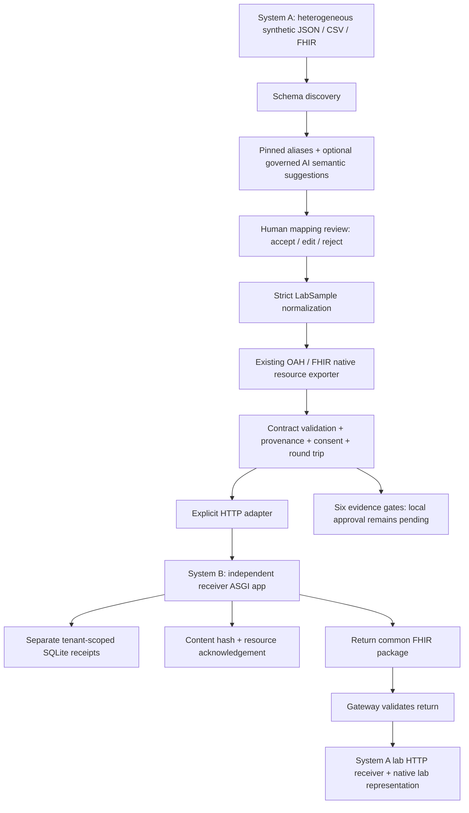

# ClinCase One Health — from water evidence to clinical action

**Primary:** OneAquaHealth Track 7 — Digital Health Standards.
**Supporting:** Track 3 — AI-Supported Assessment.
**Entry:** `/onehealth` (reviewer/admin); citizen workflow remains `/aquahealth`.

This Track 7 upgrade adds an interoperability gateway to the existing CLINI-CASE platform.
It does not claim that the entire repository was created during this hackathon. Existing
oncology, OncoTwin, CardioTwin, AquaHealth and `/onehealth` workflows remain intact.

## Problem and intended impact

Citizen stream reports, laboratory measurements and clinical histories typically travel through
separate systems. A citizen observation is valuable, but does not establish a contaminant or
an individual's exposure. ClinCase One Health carries evidence, missing information, consent
and review history across those boundaries, enabling targeted environmental investigation and
informed clinical review. Intended users: citizen contributors, environmental reviewers and
clinical reviewers. Environmental outcomes remain investigation, testing and tracked follow-up.

The [OAH draft FHIR guide](https://build.fhir.org/ig/hl7-eu/oah/) connects environmental surveillance
with human-health indicators. Its cardiovascular examples are population measures, not validated
personal disease predictors. The [organizers' standards session](https://www.oneaquahealth.eu/oneaquahealth-ieee-global-hackathon-informatics-technology-standards/)
directly addresses interoperability between environmental, citizen and health data.

## What is implemented

| Layer | Implemented behaviour |
|---|---|
| Citizen evidence | Existing AquaHealth reports, rules, human review, maps and trends retained |
| Laboratory evidence | Immutable sample record: identifier, matrix, exact location, collector, method, lab, report, collection/report times, arsenic analyte, value, unit and detection qualifier |
| Exposure history | Same-organisation patient, recorded consent, route, source-to-person evidence, treatment context and exposure dates |
| Evidence gates | No clinical-review eligibility without verified lab evidence, active consent, drinking pathway, point-of-use sample, treatment history and temporal overlap |
| Review | Authenticated reviewer verification, more-information/rejection decisions, clinical review and consent withdrawal |
| Cross-module context | OncoTwin evidence tab, separate CardioTwin exposure panel, explicit same-patient ClinCase case link |
| Flow state | Six visible gates are derived from the current AquaHealth source, lab verification, exposure gates, clinical review, ClinCase link and retest state |
| Environmental task | Investigation/retest tracking flows back to the AquaHealth overview; its patient-free API deliberately excludes patient identifiers and clinical free text |
| Exchange | Native FHIR export, validation report, editable JSON, download, round-trip checks and staged import |
| Evidence challenge | Remove one dependency on a copy and recompute eligibility; no causal or disease-risk claim |
| Storage | Atomic JSONB record/audit/task writes with optimistic versions; tenant-scoped reads and updates |

Arsenic is the narrow first use case because [WHO](https://www.who.int/news-room/fact-sheets/detail/arsenic)
documents long-term inorganic-arsenic associations with certain cancers and cardiovascular disease.
The 10 µg/L WHO value is a **provisional drinking-water guideline**, not a disease threshold or
a complete water-safety certificate. Stream/source-water samples do not receive that comparison.
Results below a reporting limit are not treated as exact values. Total arsenic is not silently
converted to inorganic-arsenic dose. No personal cancer-risk calculator is implemented.

## Four-minute demo script

1. **0:00–0:30 — problem:** open `/onehealth`; explain the water-to-clinical evidence gap and select
   **Start synthetic journey**. The citizen observation and lab result are clearly synthetic.
2. **0:30–1:15 — trust:** inspect the report and evidence gates. Add a reviewer note and verify the
   laboratory report. Select a synthetic patient, enter a synthetic consent reference, document
   drinking-water use and treatment. Choose dates spanning the sample collection. Save history.
3. **1:15–2:00 — human authority:** record clinical review. Open OncoTwin's evidence tab and the
   CardioTwin context panel. CAD inputs remain an independent scenario, not auto-matched to the
   exposure patient. Existing model probabilities are unchanged.
4. **2:00–2:45 — interoperability:** export/check the FHIR collection. Inspect native resources,
   the pinned draft contract, SHA-256 digest and sample/history round-trip checks. Change a unit
   code to `ppm`; validation must reject it. Re-export before proceeding.
5. **2:45–3:20 — adversarial evidence:** open Evidence challenge. Each missing dependency withholds
   clinical eligibility. Explain why a nearby address or a stream photo is insufficient.
6. **3:20–4:00 — close the loop:** record investigation/retest follow-up. Stage a FHIR import;
   the new record remains unverified and unlinked until local consent is recorded. Demonstrate
   consent withdrawal on the original: patient-context queries exclude it and clinical export
   is blocked. Previously downloaded files cannot be recalled by this prototype.

ClinCase case linking requires a running clinical database and an existing case in the same
organisation. The workbench loads candidates dynamically and requires explicit reviewer
attestation of patient identity; the current ClinCase case schema has no shared machine-readable
patient identifier, so the application cannot independently prove that identity match. Linking
is disabled in the volatile DB-less demo and must not be presented as a live payer submission.

## FHIR contract and validation boundaries

- Target: FHIR R4 `4.0.1`; OAH `hl7.eu.fhir.oah#0.1.0-ci-build`.
- Pinned OAH source commit: `b907cf0869b59d82d9138b3d147fca66f333d911`.
- [Pinned source profiles](https://github.com/hl7-eu/oah/tree/b907cf0869b59d82d9138b3d147fca66f333d911/input/fsh/profiles):
  `observation-indicators-oah`, `location-oah`, `specimen-oah`.
- Native specimen/observation/location fields carry the measurement. Typed questionnaire answers
  carry the exposure history; Consent, Task and Provenance describe permission and workflow.
- Local analyte/workflow codes use the repository namespace; they are not falsely labelled LOINC
  or SNOMED. Receiving systems must agree mappings. IDs in sample exports are local aliases.
- The installed `fhir.resources==7.1.0` validates **R4B base shapes**. Additional code checks selected
  pinned OAH R4 constraints, references, units, dates, patient identity and the application contract.
- This is **not full HL7 R4 profile, terminology or invariant validation**, and not certification.
  Run a full R4 validator with the pinned implementation guide and terminology service before
  claiming conformance in a clinical deployment. This limitation is visible in the API and UI.
- Round-trip checks compare decoded native sample/history fields with the original. Imports archive
  the incoming bundle, but do not inherit its consent, verification, local patient or clinical review.
- Collection imports never execute FHIR transactions or resolve arbitrary external references.
- SHA-256 is content identification, **not a digital signature** or proof a laboratory issued a report.

## API and architecture

Backend: `app/onehealth/{models,evidence,repository,fhir}.py`, `app/api/onehealth.py`.
Frontend: `src/routes/OneHealth.tsx`, `src/onehealth/{api,Forms,ContextPanel}.tsx` (API file is `.ts`).

| API under `/api/v1/onehealth` | Purpose |
|---|---|
| `GET /meta` | Track alignment, pinned contract, actual persistence mode |
| `GET /patients` | Same-organisation patients for a reviewer |
| `GET /case-candidates` | Same-organisation case picker for reviewers; reports unavailable in DB-less mode |
| `GET/POST /exposures` | List/filter records; add unverified laboratory evidence |
| `POST /exposures/{id}/verify`, `/link`, `/review` | Version-checked human decisions |
| `POST /exposures/{id}/withdraw-consent` | Stop downstream clinical visibility and export |
| `POST /exposures/{id}/case-link` | Attach reviewed evidence after explicit same-patient attestation |
| `GET /environmental-tasks` | Authenticated, patient-free environmental task projection |
| `POST /exposures/{id}/followup` | Record investigation and follow-up |
| `GET /exposures/{id}/fhir` | Export and native-field round-trip check |
| `POST /exchange/validate`, `/exchange/import` | Validate/preview and stage unverified evidence |
| `POST /demo` | New labelled synthetic scenario, never automatically approved |

No PHI is sent to an LLM or third-party FHIR validator by this feature. It reuses existing bearer
authentication and organisation IDs. All patient-linked routes require reviewer/admin. Frontend
roles are only UX; backend permissions are authoritative. Public metadata contains no records.

`onehealth_exposures` is created during normal application bootstrap. The record, review, audit
and task live in one versioned payload and update in a single SQL statement. Conflicts return
HTTP 409. Database errors do not silently redirect clinical writes into memory. Without an active
database pool only **synthetic records** may be saved, in a process-local store; real writes return
HTTP 503. This is not a multi-replica durable deployment mode.

## Run and verify

Use the repository's normal backend/frontend setup and reviewer login. No new runtime dependency
is required. For a local synthetic-only session, enable the existing explicit DB-less demo auth
setting in a development environment; do not enable it in production. Open `/onehealth`.

```sh
cd backend
python -m pytest tests/onehealth tests/aquahealth
python -m ruff check app/onehealth app/api/onehealth.py tests/onehealth
cd ../frontend
npm run typecheck
npm test
npm run build
```

Regression tests exercise fail-closed gates, unit conversion, malformed resources, native-field
round trips, trust reset, duplicate import, concurrent update rejection, role/tenant boundaries,
reviewer identity spoofing and consent withdrawal. These are software tests, **not clinical or
ecological validation**. OncoTwin's synthetic evaluation and CardioTwin's clinical-data evaluation
remain scoped to their original models and cannot establish water-to-disease prediction.

## Remaining deployment work

Full R4/OAH terminology validation; institutional lab identity/signatures; a real consent service;
patient identity reconciliation; retention and remote revocation policy; field-study evaluation;
clinical validation and regulatory review. Existing real-patient ingestion and clinical-database
availability determine whether non-synthetic cross-module use is possible.


## Newly added: One Health Interoperability Gateway

**Positioning:** An evidence-aware One Health interoperability gateway that converts
heterogeneous environmental, laboratory and health observations into validated OAH/FHIR
exchanges while preserving provenance, consent and human review.

The `/interop` route is the new judge-facing workbench. `/onehealth` remains the clinical
evidence workflow. The new code lives in `backend/app/interop`, `backend/app/api/interop.py`,
`frontend/src/interop` and `frontend/src/routes/Interop.tsx`; it reuses existing One Health
FHIR export, validation, decoding, evidence logic and reviewer authorization.



### Continuous golden-path demo

1. Sign in as a reviewer/admin and open `/interop`. Select **Start Track 7 Interoperability Demo**.
   This imports a clearly synthetic external laboratory record with mixed field names.
2. Select **Analyze schema and propose mappings**. Offline mode uses deterministic rules and
   explicitly says that no model was called. To exercise real AI, enable **Request model semantic
   suggestions** with the existing LLM provider configured. Only field names, the target allowlist
   and the Pydantic schema are sent. Provider errors are visible and never labelled AI success.
3. Inspect rule/model origin, confidence score, unresolved terminology and suggested FHIR targets.
   Accept each supported field, explicitly choose **Total arsenic - local code** only because
   the synthetic fixture represents that assay, and reject the unsupported legacy note. Unknown
   fields remain in the original source artifact. Edit targets through the field dropdowns.
4. Generate the reviewed bundle. Existing exporter creates Location, Specimen, Observation,
   Organization, PractitionerRole, environmental Task, QuestionnaireResponse and transformation
   Provenance/actor. No Patient or Consent is invented for a patient-free laboratory record.
5. Inspect validation, SHA-256 and measured native-field round-trip counts. Transfer to independent
   Clinical System B. It receives serialized FHIR through HTTP, validates it again, stores its own
   package and native representation, and acknowledges the exact hash and resource count.
6. Select **Return FHIR/OAH from System B to Lab A**. The gateway retrieves FHIR through HTTP,
   validates it and sends it to the lab receiver namespace over HTTP. Both native representations,
   the returned bundle and the lab acknowledgement are visible.
7. Select **Run validation failure**. This changes the unit to `ppm`; the validation gate rejects it.
   Transfer stays disabled. Restore the generated bundle and validate again to recover.
8. Follow the correlation ID across source receipt, schema discovery, reviewer decisions,
   transformation, validation, transfer and return. Copy the ID into **Resume transaction** to
   reload persisted work. In volatile demo mode, jobs disappear when the backend restarts.

The six evidence gates are surfaced after exchange. Laboratory verification remains false at
an independent receiver and clinical review remains pending. Source consent/history claims are
retained when processing supported patient-linked FHIR, but never create/overwrite local patient
records. Use the existing `/onehealth` workflow for local verification, consent and clinical review.
No environmental measurement changes a cancer authorization, NCCN conclusion, OncoTwin result
or CardioTwin calculation.

### Additive API surface

All gateway endpoints use `/api/v1/interop` and reviewer/admin authorization:

| Method | Path | Purpose |
|---|---|---|
| GET | `/meta` | Supported targets, standards, storage and simulator mode |
| POST | `/import`, `/simulators/lab/send` | Import one JSON/CSV/supported FHIR source record |
| POST | `/demo` | Load labelled synthetic laboratory input |
| POST | `/analyze-schema`, `/map` | Discover fields and propose typed mappings |
| POST | `/mappings/{job_id}/approve`, `/mappings/{job_id}/reject` | Versioned per-field decisions / edits |
| POST | `/generate-fhir` | Normalize confirmed source and reuse existing FHIR exporter |
| POST | `/validate` | Validate editable challenge bundle; approved generated bundle stays separate |
| POST | `/transfer` | Validate exact hash and deliver/retry through HTTP |
| POST | `/return` | Receive FHIR from clinical system and deliver it back to lab receiver |
| GET | `/jobs/{id}`, `/bundle/{id}`, `/events/{id}`, `/transfers/{id}` | Read the scoped transaction snapshot |

The read aliases return the transaction snapshot, including the requested artifact. Mutations
require `job_id` and `expected_version`. Approval additionally requires `source_field`, with an
optional supported `target` and explicit local analyte `concept`. Generation requires every
mapping to be accepted or rejected; missing required assay metadata fails rather than being
invented. JSON/CSV currently support one laboratory sample per package and two local arsenic
analytes, with `ug/L` or `mg/L`; this is intentionally a narrow reliable path.

### Independent receiver and deployment

Default demo mode uses an independent ASGI application through `httpx.ASGITransport`: requests
and responses cross an explicit serialized HTTP boundary, with separate SQLite receipt storage.
This default is **not a separate network process**. To show a real network boundary, launch from
`backend` in another terminal:

```powershell
$env:INTEROP_RECEIVER_TOKEN = '<choose a shared service secret>'
$env:INTEROP_RECEIVER_DB = 'interop-receiver.sqlite3'
.venv/Scripts/python.exe -m uvicorn app.interop.receiver:app --host 127.0.0.1 --port 8091
```

Set the same `INTEROP_RECEIVER_TOKEN` and `INTEROP_RECEIVER_URL=http://127.0.0.1:8091`
in the gateway process. The receiver exposes `POST /fhir`, `GET /exchanges/{correlation_id}`
and `POST /lab/fhir`. It uses service authentication plus explicit tenant scope, accepts synthetic
bundles only, never reads gateway/clinical state, and stores clinical/lab receipts in distinct
correlation namespaces. Do not reuse it as a real patient system.

Gateway persistence follows existing PostgreSQL patterns: `interop_jobs` contains CAS metadata;
`interop_artifacts` separates source, discovered fields, mappings, normalized sample, bundle,
validation, transfer records and audit events. All keys include organization identity and writes
are transactional. The existing synthetic-only memory fallback applies without PostgreSQL.
Transfers persist `processing` before delivery, then `delivered`, `rejected` or `failed`; retries
reuse the correlation ID, and the receiver rejects a changed hash under the same identity.
A crash after delivery can be recovered by retrying; no background queue or automatic retry
scheduler is added.

### Validation, terminology and limitations

Wording: **FHIR R4-targeted OAH exchange with pinned profile-aware contract checks and
round-trip validation.** This is not full HL7 R4 profile/terminology certification. Existing R4B
base-model checks, selected pinned OAH constraints and local exchange-contract checks remain.
The gateway adds supported-resource, transformation-provenance and active-consent transfer
checks; the receiver repeats those checks. Checks cover references, identity duplication, dates,
UCUM units/codes, patient binding, consent consistency and review-state consistency through
the reused validator. Runtime counters report executed check groups, not an invented count of
FHIR invariants. Round-trip counters count normalized sample fields, not every raw source field.
Unsupported raw fields stay in source storage and are not claimed to be native FHIR mappings.

AI uses the existing governed provider abstraction with tenant/correlation context. Suggestions
are validated with strict Pydantic contracts and allowlisted targets; all remain pending review.
Rule confidence is a fixed rule score, model confidence is a model-reported suggestion score,
and neither is calibrated accuracy. Terminology is transparently local/unresolved; no verified
LOINC, SNOMED CT, ICD or RxNorm mappings are invented. Consent and provenance are retained
claims, not digital signatures or independently authenticated external clinical approval.

Synthetic fixtures are in `backend/data/interop`: messy environmental JSON, one-row laboratory
CSV, valid FHIR bundle and intentionally invalid unit bundle. Deterministic API tests exercise
the continuous cross-system journey, adversarial validation, typed model suggestions/failure,
review, privacy, authorization, CAS, receipt idempotency and retry. Live-provider operation
requires configured credentials and is not required for the deterministic offline demo.


The existing governed model gateway requires PostgreSQL for quota enforcement and invocation
audit writes. With that governance enabled, synthetic memory mode reports AI unavailable;
it does not bypass the controls. Configure the existing database and provider for live AI.
Run the authenticated network demo from `backend` with
`.venv/Scripts/python.exe scripts/interop_demo.py`; `--ai` requests the real provider and
`--fixtures` regenerates the labelled valid/broken bundle fixtures. The script honors existing
HTTP rate-limit retry headers. AI success and offline success are reported separately.
